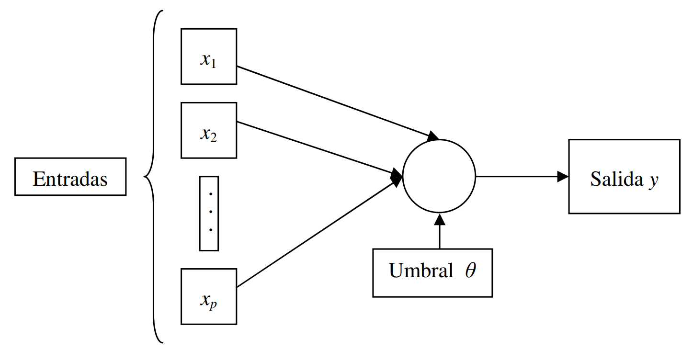
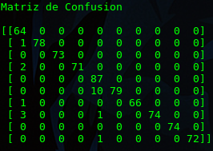
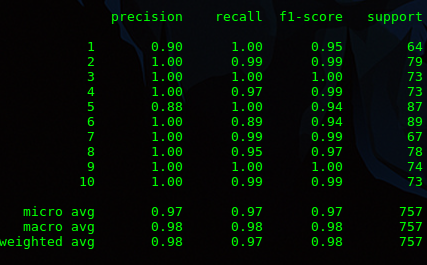
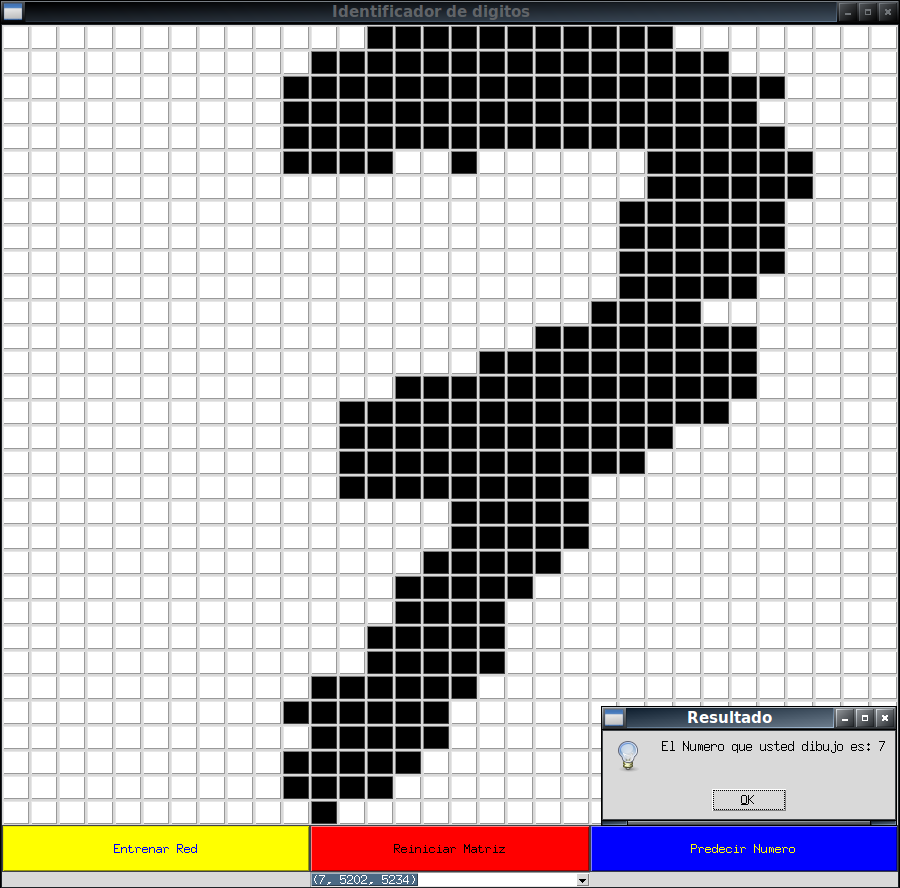

   

# Digit Identifier I.A2

### Intercycle Project
**Students:** Frank Montalvo Ochoa , Damián Gutiérrez 

## What is a perceptron and how does it work?

A perceptron is defined as the simplest form of a neural network, it is used for the classification of a special type of patterns, the linearly separable ones (found on both sides of a hyperplane). Basically, it consists of a neuron with adjustable synaptic weights and threshold. An algorithm is used to adjust the free parameters of this neural network, this appeared for the first time in a learning procedure developed by Rosenblatt, he showed that, if the patterns used to train the perceptron are derived from two linearly separable classes, then the The perceptron algorithm converges and takes as a decision surface a hyperplane between these two classes. The convergence test of the algorithm is known as the perceptron convergence theorem.

   

For example, a perceptron of a layer having only one neuron is described. This perceptron is limited to perform pattern classification with only two classes. By expanding the output layer of the perceptron to include more than one neuron, we can perform this classification with more than two classes. However, the classes would have to be linearly separable for the perceptron to work correctly.

## Neural Network

A neural network is a simplified model that emulates the way in which the human brain processes information; it works simultaneously with a high number of interconnected processing units that look like abstract versions of neurons. The processing units are organized in layers and there are three parts normally in a neural network:
* An input layer, with units representing the input fields
* One or several hidden layers, and
* An output layer, with a unit or units representing the field or fields of destination.
The units are connected with variable connection forces (or weights). The input data is presented in the first layer, and the values are propagated from each neuron to each neuron of the next layer, finally, a result is sent from the output layer. The network learns by examining the individual records, generating a prediction for each record and making adjustments to the weights when it makes an incorrect prediction. This process is repeated many times and the network continues to improve its predictions until it has reached one or more stop criteria. At first, all the weights are random and the responses that result from the network are, possibly, crazy. The network learns through training. The examples are continually presented to the network for which the result is known, and the answers provided are compared with the known results. The information from this comparison is passed back through the network, changing the weights gradually. As the training progresses, the network becomes increasingly accurate in the replication of known results. Once trained, the network can be applied to future cases in which the result is unknown.

## Logistic activation

This model optimizes the record loss function using LBFGS or stochastic gradient descent. L-BFGS is a method of minimization or quasi-Newton optimization of functions with a large number of parameters or of great complexity. It is a method that makes limited use of memory (it uses much less memory than other algorithms for the same problem). L-BFGS comes from BFGS of limited memory, it allows to obtain the minimum of a function. It only needs the function and its gradient, but not the Hessian matrix. L-BFGS, developed by Jorge Nocedal is able to solve functions without restrictions, while the variant L-BFGS-B (Jorge Nocedal and Richard Byrd) can solve functions with simple constraints (of the type li <xi <ui where xi is the variable i-th and li and ui the lower and upper limits of that variable) in its parameters. If the restrictions are complex, other methods, such as KNITRO, should be used. For each iteration the algorithm looks for an approximation of the Hessian matrix, specifically its inverse. If the function has N variables, the Hessian matrix has N ^ 2 elements. If N is large, the time needed to calculate the entire matrix exactly can be prohibitive. This is why an approximation is sought. Logistic regression is an automatic learning classification algorithm that is used to predict the probability of a categorical dependent variable. Basically, it can be evident that the logistic regression as a neural network of a layer. In addition, the logistic regression has a large robust model for simple classification tasks.

For more information in the following video:

 

# Aplication

## Interface

   

## Panel

   

## Matrix of confusion 

   

## Precision of the network  

   

## Predicting the network

   

# Bibliography
1. http://bibing.us.es/proyectos/abreproy/11084/fichero/Memoria+por+cap%C3%ADtulos+%252FCap%C3%ADtulo+4.pdf+
2. https://www.ibm.com/support/knowledgecenter/es/SS3RA7_sub/modeler_mainhelp_client_ddita/components/neuralnet/neuralnet_model.html

