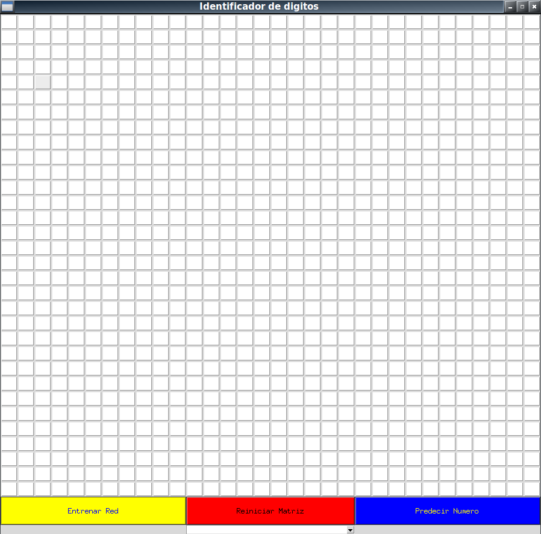

   

# Identificador de Dígitos I.A2

### Proyecto Interciclo
**Alumnos:** Frank Montalvo Ochoa , Damián Gutiérrez 

## ¿Que es un perceptrón y cómo funciona?

Se define a un perceptrón como la forma más simple de una red neuronal, es usada para la clasificación de un tipo especial de patrones, los linealmente separables (que se encuentran a ambos lados de un hiperplano). Básicamente, consiste de una neurona con pesos sinápticos y umbral ajustables.
Se usa un algoritmo para ajustar los parámetros libres de esta red neuronal, esta apareció por primera vez en un procedimiento de aprendizaje desarrollado por Rosenblatt, el demostró que, si los patrones usados para entrenar el perceptrón son sacados de dos clases linealmente separables, entonces el algoritmo del perceptrón converge y toma como superficie de decisión un hiperplano entre estas dos clases. La prueba de convergencia del algoritmo es conocida como el teorema de convergencia del perceptrón.

   

Por ejemplo, se describe un perceptrón de una capa que tiene sólo una neurona. Dicho perceptrón está limitado a realizar clasificación de patrones con sólo dos clases. Expandiendo la capa de salida del perceptrón para incluir más que una neurona, podemos realizar dicha clasificación con más de dos clases. Sin embargo, las clases tendrían que ser linealmente separables para que el perceptrón trabaje correctamente.

## Red Neuronal

Una red neuronal es un modelo simplificado que emula el modo en que el cerebro humano procesa la información, funciona simultaneando un número elevado de unidades de procesamiento interconectadas que parecen versiones abstractas de neuronas.
Las unidades de procesamiento se organizan en capas y existen tres partes normalmente en una red neuronal:

* Una capa de entrada, con unidades que representan los campos de entrada
* Una o varias capas ocultas, y 
* Una capa de salida, con una unidad o unidades que representa el campo o los campos de destino. 
	
Las unidades se conectan con fuerzas de conexión variables (o ponderaciones). Los datos de entrada se presentan en la primera capa, y los valores se propagan desde cada neurona hasta cada neurona de la capa siguiente, finalmente, se envía un resultado desde la capa de salida.
La red aprende examinando los registros individuales, generando una predicción para cada registro y realizando ajustes a las ponderaciones cuando realiza una predicción incorrecta. Este proceso se repite muchas veces y la red sigue mejorando sus predicciones hasta haber alcanzado uno o varios criterios de parada.
Al principio, todas las ponderaciones son aleatorias y las respuestas que resultan de la red son, posiblemente, disparatadas. La red aprende a través del entrenamiento. Continuamente se presentan a la red ejemplos para los que se conoce el resultado, y las respuestas que proporciona se comparan con los resultados conocidos. La información procedente de esta comparación se pasa hacia atrás a través de la red, cambiando las ponderaciones gradualmente. A medida que progresa el entrenamiento, la red se va haciendo cada vez más precisa en la replicación de resultados conocidos. Una vez entrenada, la red se puede aplicar a casos futuros en los que se desconoce el resultado.

## Activación logística

Este modelo optimiza la función de pérdida de registro utilizando LBFGS o descenso de gradiente estocástico. L-BFGS es un método de minimización u optimización quasi-Newton de funciones con un gran número de parámetros o de una gran complejidad. Se trata de un método que hace un uso limitado de la memoria (usa mucha menos memoria que otros algoritmos para el mismo problema). 
L-BFGS viene de BFGS de memoria limitada, permite obtener el mínimo de una función. Únicamente necesita la función y su gradiente, pero no la matriz Hessiana. L-BFGS, desarrollado por Jorge Nocedal es capaz de resolver funciones sin restricciones, mientras que la variante L-BFGS-B (Jorge Nocedal y Richard Byrd) puede resolver funciones con restricciones simples (del tipo li < xi < ui siendo xi la variable i-ésima y li y ui los límites inferior y superior de esa variable) en sus parámetros. Si las restricciones son complejas otros métodos, como KNITRO, deben ser usados.
Para cada iteración el algoritmo busca una aproximación de la matriz Hessiana, concretamente de su inversa. Si la función tiene N variables, la matriz Hessiana tiene N^2 elementos. Si N es grande, el tiempo necesario para calcular toda la matriz de forma exacta puede ser prohibitivo. Es por esto que se busca una aproximación.
La regresión logística es un algoritmo de clasificación de aprendizaje automático que se utiliza para predecir la probabilidad de una variable dependiente categórica. Básicamente, puede ser evidente que la regresión logística como una red neuronal de una capa. Además, la regresión logística tiene un gran modelo robusto para tareas de clasificación simples.

# Anexo Aplicación

## Interfaz

   

## Panel

   

## Matriz de confusión 

   

## Precisión de la red  

   

## Predicción de la red

   

# BIBLIOGRAFIA
1. http://bibing.us.es/proyectos/abreproy/11084/fichero/Memoria+por+cap%C3%ADtulos+%252FCap%C3%ADtulo+4.pdf+
2. https://www.ibm.com/support/knowledgecenter/es/SS3RA7_sub/modeler_mainhelp_client_ddita/components/neuralnet/neuralnet_model.html

